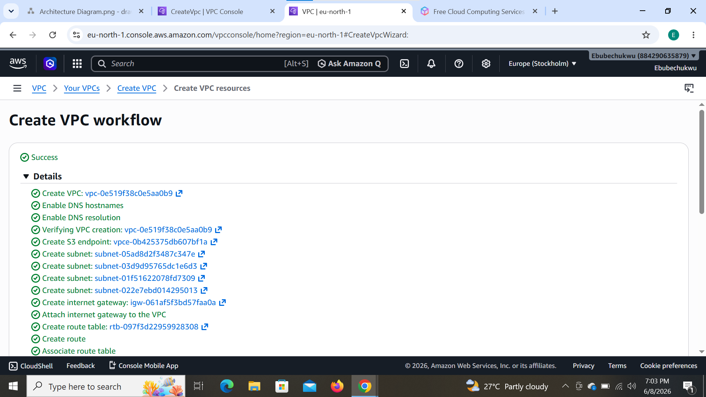
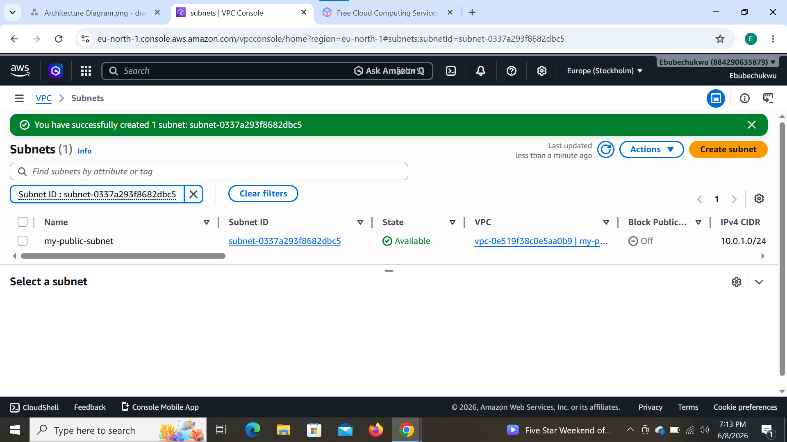
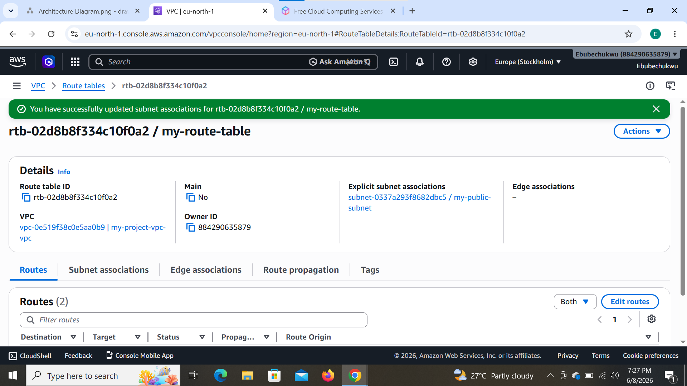
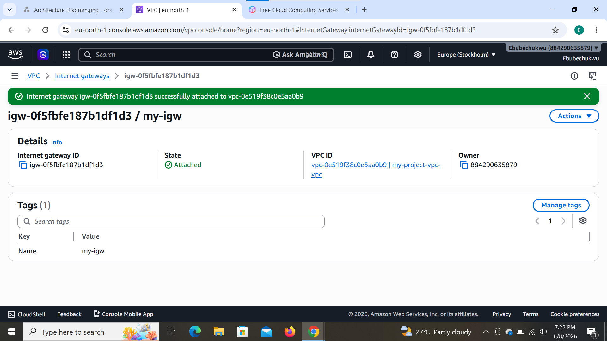
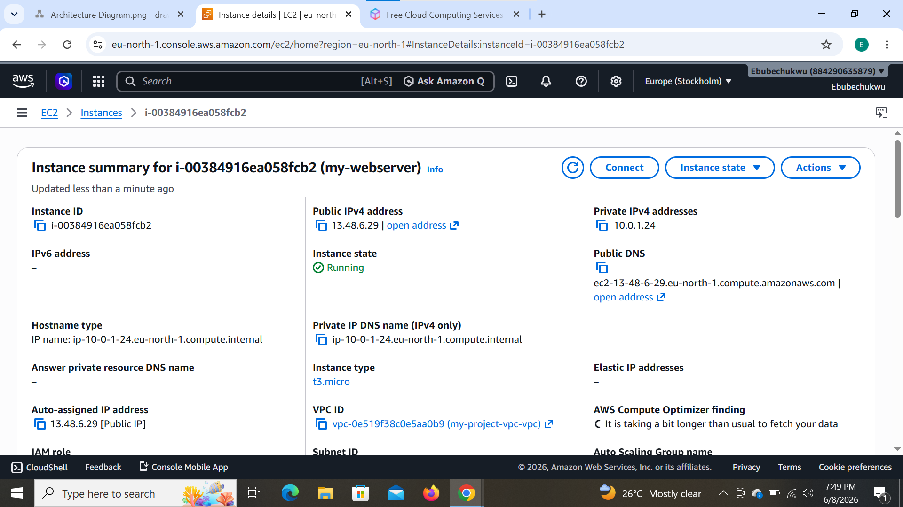
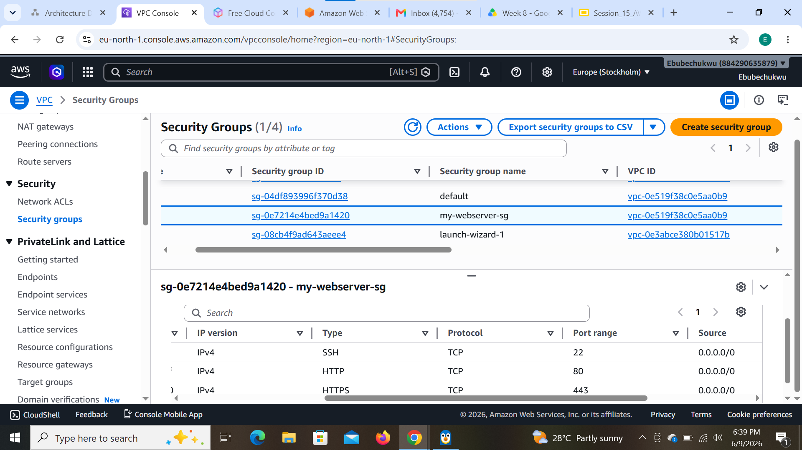
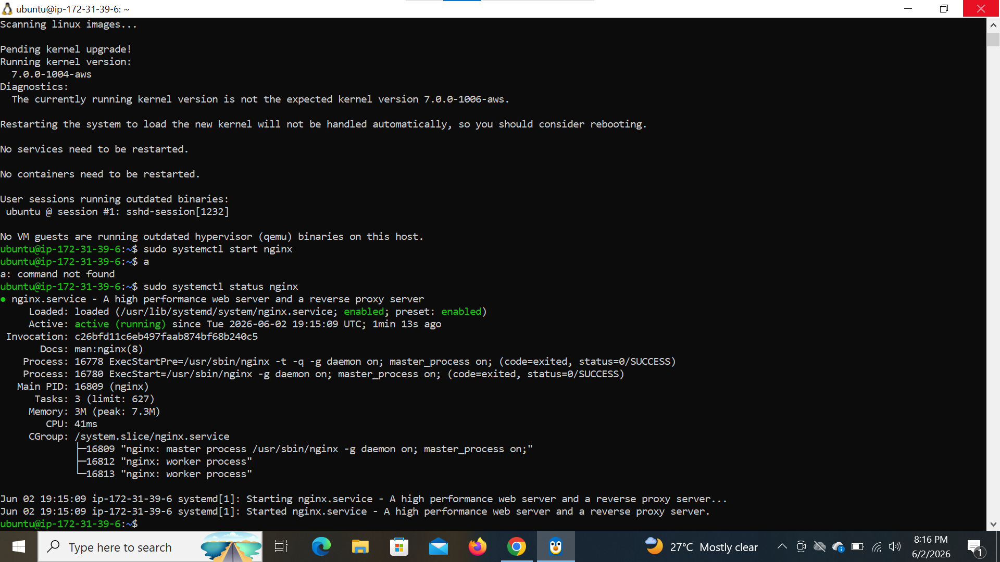
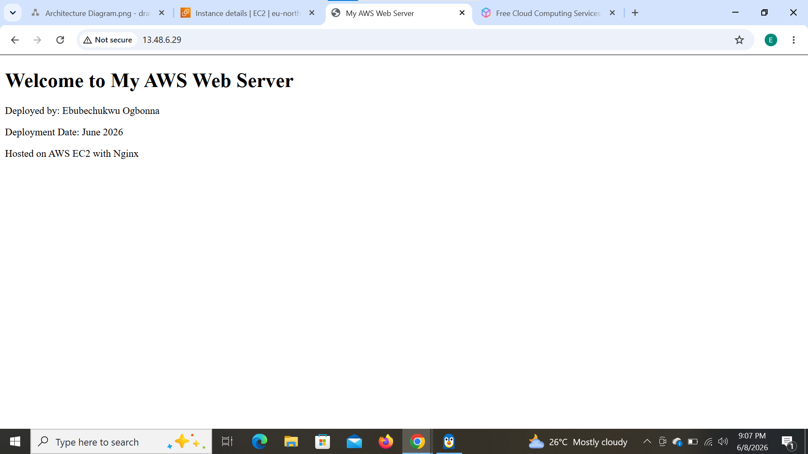

# AWS Web Server Project

## Project Overview
This project demonstrates the deployment of a secure, publicly accessible web server 
on AWS following cloud networking and security best practices. It covers the full 
process — from designing the network architecture and provisioning AWS resources, 
to configuring a Linux server, securing it with proper IAM and Security Group rules, 
and serving a live webpage using Nginx.

## Architecture

## AWS Resources
- VPC: 10.0.0.0/16
- Subnet: 10.0.1.0/24
- EC2: Ubuntu Server
- Web Server: Nginx

## Live URL
http://13.48.6.29

## Project Files
- `troubleshooting.md` - Issues encountered and solutions
- `project-report.md` - Full project documentation
- `screenshots/` - ## Screenshots

### VPC Configuration

*Custom VPC created with CIDR block 10.0.0.0/16*

### Public Subnet

*Public subnet configured with CIDR 10.0.1.0/24*

### Route Table

*Route table configured with 0.0.0.0/0 route pointing to the Internet Gateway*

### Internet Gateway

*Internet Gateway created and attached to the VPC*

### EC2 Instance

*EC2 Ubuntu instance running with a public IP address assigned*

### Security Group

*Security group configured to allow SSH (port 22), HTTP (port 80), and HTTPS (port 443)*

### Nginx Service Running

*Nginx web server active and running on the EC2 instance*

### Live Webpage

*Custom webpage successfully deployed and accessible via the EC2 public IP*
